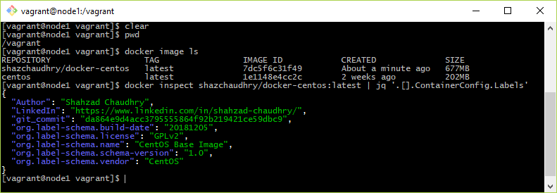

This CentOS 7 based Docker image contains a number of DevOps tools such as Maven, JDK 1.8, Ansible, Terraform, etc. The purpose of this image is to use it in a Jenkins' declarative pipeline as an agent. This means the host running Jenkins does not require installing the DevOps tools mentioned previously.

As an example on how this image is used in a Jenkins based CI / CD pipeline, see this DevOps repo: [https://github.com/shazChaudhry/docker-devops](https://github.com/shazChaudhry/docker-devops/blob/master/Jenkinsfile)

NOTE:
> This image has been tested on Windows 10 pro machine and in a VirtualBox only. It is assumed you already have installed VirtualBox, Vagrant and Git Bash on your machine.

# Instructions
1. Start a Git Bash shell and change to a suitable directory _(e.g. $HOME/github)_
1. Clone this repo: `git clone https://github.com/shazChaudhry/docker-centos.git` and change the directory _(e.g. $HOME/github/docker-centos)_
1. Create a VM and then SSH to it: `vagrant up && vagrant ssh`
1. Changed to the Vagrant synced folder: `cd /vagrant`
1. Run this command to build the image locally: `docker image build --no-cache --tag shazchaudhry/docker-centos:latest --build-arg SOURCE_BRANCH=master --build-arg GIT_COMMIT=$(git log -1 --format=%H) .`
1. List the images to ensure our image has been built: `docker image ls`
1. Run this command to find the git commit from which this image is built: `docker inspect shazchaudhry/docker-centos:latest | jq '.[].ContainerConfig.Labels'`

# Testing
Exec into this container and check if tools have indeed been installed:
1. `docker container run -it --rm --name centos7 shazchaudhry/docker-centos:latest bash`
1. `terraform --version`. This should confirm v0.11.11
1. `ansible --version`. his should confirm the latest version available on CentOS7 available through yum package management. At the time of writing this, the version is v2.7.5
1. `mvn --version`. This should confirm v3.6.0
1. `git --version`. This should confirm the latest version available on CentOS7 available through yum package management. At the time of writing this, the version is v1.8.3.1
1. `java -version`. This should confirm v1.8.0
1. `javac -version`. This should confirm v1.8.0
